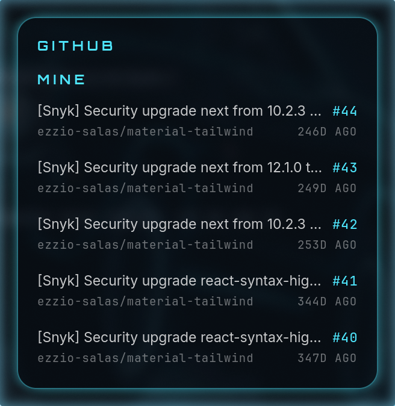

# GitHub Cockpit

A small frameless widget for Linux and macOS that floats above your windows and shows the open pull
requests waiting on you: the ones you opened, and the ones asking for your review.



Each row is a pull request — its title, its number, and the repository underneath. Click a
row to open it in your browser.

It is the sibling of [Claude Cockpit](https://github.com/ezzio-salas/claude-cockpit) and
keeps its look and its habits.

**On macOS?** The native AppKit build lives in [`macos/`](macos); see
[its README](macos/README.md). The rest of this page covers the Linux build.

## Requirements

- A Wayland compositor. Developed on [Hyprland](https://hypr.land); anything supporting the
  layer-shell protocol works.
- Python 3.11 or later, with GTK 4 and PyGObject.
- [`gtk4-layer-shell`](https://github.com/wmww/gtk4-layer-shell), so the card can float
  above full-screen windows without ever taking focus.
- The [GitHub CLI](https://cli.github.com), signed in. Check with:

  ```sh
  gh auth status
  gh search prs --author=@me --state=open
  ```

  If that lists nothing and you have open pull requests, the widget has nothing to show.

On Arch:

```sh
sudo pacman -S python python-gobject gtk4 gtk4-layer-shell github-cli
gh auth login
```

## Setup

```sh
git clone https://github.com/ezzio-salas/github-cockpit.git
cd github-cockpit
./install.sh
github-cockpit
```

`install.sh` writes a launcher to `~/.local/bin`, a desktop entry to
`~/.local/share/applications` and the bundled Orbitron font to `~/.local/share/fonts`.
Nothing is written outside `~/.local`, and the launcher runs the widget from the checkout,
so `git pull` is all an update takes.

To run it without installing anything, use `./run.sh`.

To start it when you log in, on Hyprland:

```conf
# ~/.config/hypr/hyprland.conf
exec-once = github-cockpit
```

### Blur behind the card

The card is translucent; the blur is the compositor's to draw. On Hyprland:

```conf
# ~/.config/hypr/hyprland.conf
layerrule = blur, github-cockpit
layerrule = ignorealpha 0.1, github-cockpit
```

## Using it

The app has no taskbar entry and no tray icon; the floating card is the whole interface.

| Action | Result |
| --- | --- |
| Click a row | Opens that pull request in your browser. |
| Drag the card | Moves it. The position is remembered between launches. |
| Right-click the card | Menu with **Refresh**, **Open GitHub Pull Requests** and **Quit**. |

The card stays above other windows on every workspace, including full-screen ones, and
never takes keyboard focus.

Pull requests are re-read every 60 seconds.

### The sections

| Section | Shows |
| --- | --- |
| `MINE` | Open pull requests you opened, across all of GitHub. |
| `REVIEW` | Open pull requests waiting on your review. |

Each section lists the five most recently updated, and is hidden when it is empty. A draft
pull request is dimmed.

### When a read fails

The widget only ever shows pull requests it actually read from GitHub.

- If it has an earlier reading, it keeps showing it dimmed, with `STALE · 2m` (time since
  the last good read) in the header. The next successful read clears it.
- If it has no reading yet, it shows one of these instead of the sections:

| Message | Meaning |
| --- | --- |
| `READING PULL REQUESTS` | The first read is in progress. |
| `GH CLI NOT FOUND` | The `gh` executable was not found. See [Troubleshooting](#troubleshooting). |
| `TIMED OUT` | `gh` did not answer within 20 seconds. |
| `NOT SIGNED IN` | `gh` is installed but not signed in. Run `gh auth login`. |
| `COULD NOT READ PRS` | `gh` exited with an error, for example with no network. |
| `UNRECOGNIZED OUTPUT` | `gh` answered, but not with a list of pull requests. |

`NO OPEN PULL REQUESTS` is not a failure — it means both sections are empty.

## Personalizing

Settings live in `~/.config/github-cockpit/config.json`. The file is created the first time
the card is moved; until then every value is the default. Restart the widget after editing
it.

```json
{
  "title": "GITHUB",
  "accentColor": "#4FE8FF",
  "borderColor": "#4FE8FF",
  "glowColor": "#4FE8FF",
  "marginTop": 12,
  "marginRight": 40
}
```

| Setting | Default | Notes |
| --- | --- | --- |
| `title` | `GITHUB` | Shown in capitals, up to 14 characters. Blank for the default. |
| `accentColor` | cyan `#4FE8FF` | The section titles, the status note and the pull request numbers. |
| `borderColor` | cyan `#4FE8FF` | The thin outline of the card. |
| `glowColor` | cyan `#4FE8FF` | The soft halo around the card. |
| `marginTop` | `12` | Distance from the top of the screen, in pixels. |
| `marginRight` | `12` | Distance from the right of the screen. Dragging the card writes both. |

An unreadable file, or a single unreadable value in it, falls back to the default rather
than stopping the widget.

## Using another GitHub account

`gh` is signed in to one account at a time. To read a different one, point the widget at a
wrapper that selects it, by adding to the config file:

```json
{ "cliCommand": "gh-work" }
```

The value is either a command name, found the same way `gh` is, or a path to an executable
such as `~/.local/bin/gh-work`. It has to be an executable file; a shell alias will not
work, because those exist only inside an interactive shell. A small wrapper does the job:

```sh
#!/bin/bash
# ~/.local/bin/gh-work — the GitHub CLI with a separate config directory
export GH_CONFIG_DIR="$HOME/.config/gh-work"
exec /usr/bin/gh "$@"
```

Make it executable with `chmod +x ~/.local/bin/gh-work`, then `gh-work auth login` once.

## How it works

Every refresh runs the GitHub CLI twice, without a terminal:

```sh
gh search prs --author=@me           --state=open --limit=5 --sort=updated --json=…
gh search prs --review-requested=@me --state=open --limit=5 --sort=updated --json=…
```

`gh search prs` searches all of GitHub, so the card is not tied to one repository or to the
directory you started it from. Only the fields the card draws are asked for.

The widget makes no network requests of its own and never touches your token; signing in is
entirely `gh`'s business.

## Troubleshooting

**`GH CLI NOT FOUND`** — Apps started from a desktop entry do not always inherit your
shell's `PATH`. The widget looks for `gh` in `~/.local/bin`, mise's shims,
`/usr/local/bin` and `/usr/bin`, then on `PATH`. Make sure it is in one of those, or set
`cliCommand` to its full path.

**The card is an ordinary window** — `gtk4-layer-shell` is missing; the log says so at
startup. Install it (`sudo pacman -S gtk4-layer-shell`). If you would rather not, tell your
compositor to treat the window as a widget:

```conf
# ~/.config/hypr/hyprland.conf
windowrulev2 = float,    class:^(local\.github-cockpit)$
windowrulev2 = pin,      class:^(local\.github-cockpit)$
windowrulev2 = noborder, class:^(local\.github-cockpit)$
windowrulev2 = noblur,   class:^(local\.github-cockpit)$
windowrulev2 = nofocus,  class:^(local\.github-cockpit)$
```

**The labels are not in Orbitron** — The font is copied to
`~/.local/share/fonts/github-cockpit` on first launch. If that failed, run `./install.sh`,
or copy `resources/Orbitron.ttf` there yourself and run `fc-cache -f`.

**Seeing why a read failed** — Failures are logged to stderr. Start it from a terminal with
`./run.sh` to watch them.

**A section is missing** — Empty sections are hidden. Confirm with the same query the
widget runs: `gh search prs --review-requested=@me --state=open`.

## Development

```sh
python3 -m venv .venv && .venv/bin/pip install pytest
.venv/bin/python -m pytest        # unit tests for everything in cockpit_core
./run.sh                          # run from the checkout
```

| Path | Contents |
| --- | --- |
| `src/cockpit_core` | Fetching, parsing, time formatting and appearance. No GTK, fully unit-tested. |
| `src/github_cockpit` | The GTK4 card, its window and its stylesheet. |
| `tests` | Unit tests. The fetcher runs against stand-in `gh` scripts, so none reach the network. |
| `resources` | The Orbitron font and its license. |
| `docs/design.md` | The design notes the widget was built from. |

## Credits

Labels are set in [Orbitron](https://fonts.google.com/specimen/Orbitron), used under the
SIL Open Font License (`resources/Orbitron-OFL.txt`).
